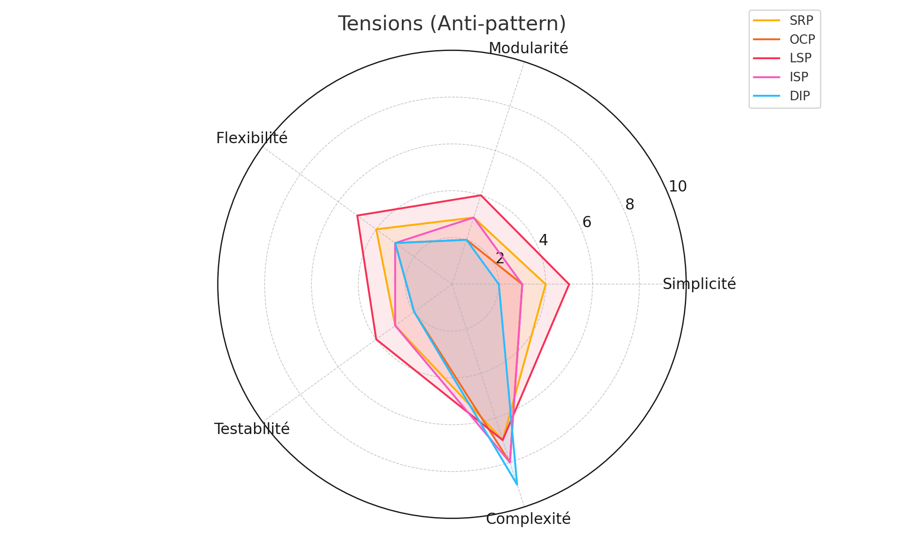
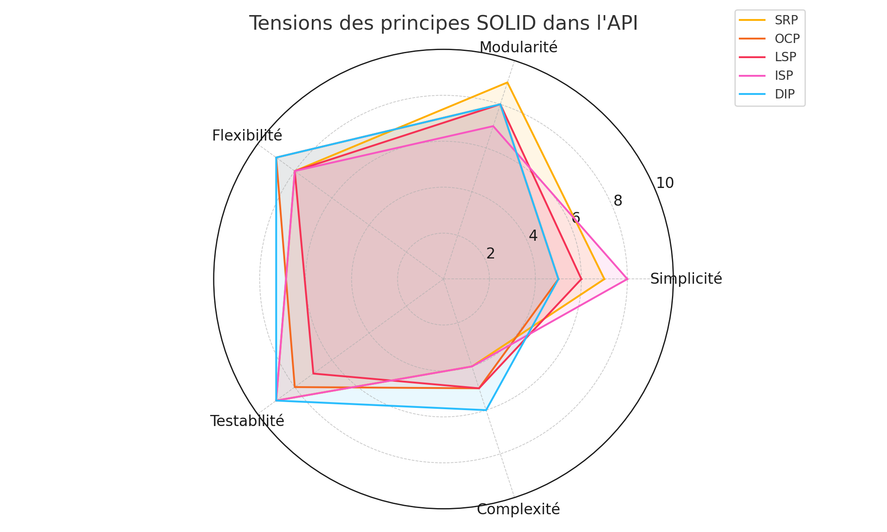
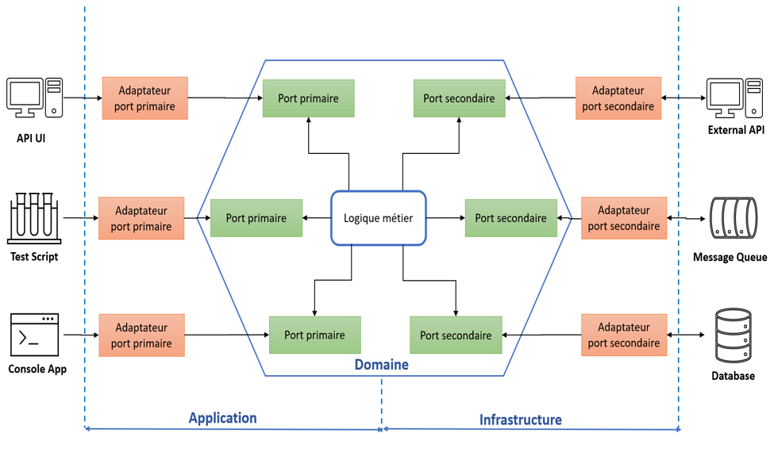
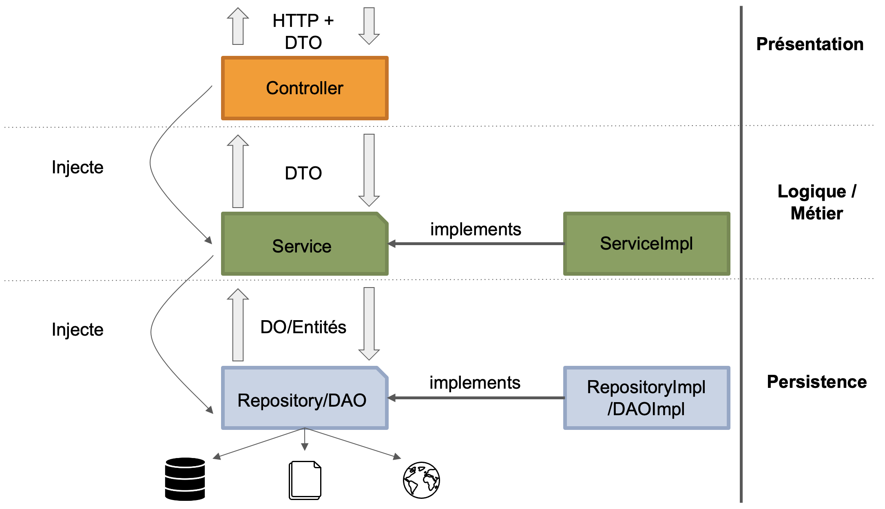

<!-- _class: lead -->
<!-- _paginate: false -->

# Séminaire sur les Principes SOLID et la Dette Technique

---

## Sommaire

1. Introduction à l'Architecture Logicielle
2. Appliquer les principes SOLID aux modules d’une application
3. Maintenir la dette technique sous contrôle

</div>

---

<!-- _class: lead -->
<!-- _paginate: false -->

## Introduction à l'Architecture Logicielle

---

## Introduction à l'Architecture Logicielle

#### Définition

<br/>

<div style="font-size:30px">

- L'architecture logicielle implique la définition des composants ou modules d'un système logiciel, ainsi que des interfaces par lesquelles ces modules interagissent.
- Elle inclut également les directives qui régissent leur interaction, leur intégration, et la stratégie de leur déploiement et maintenance.
- Les architectes logiciels utilisent divers outils et modèles, comme les diagrammes UML (Unified Modeling Language), pour décrire la structure, le comportement et les interactions des composants au sein du système.

</div>

---

## Introduction à l'Architecture Logicielle

#### Importance de l'Architecture Logicielle

<br/>

<div style="font-size:28px">

1. **Facilite la communication:** L'architecture fournit une vue de haut niveau du système qui est compréhensible pour les parties prenantes à tous les niveaux. Cela aide les développeurs, les gestionnaires de projet, et les parties prenantes non techniques à comprendre le système et ses interactions.

2. **Prise de décision éclairée:** L'architecture sert de support à la prise de décision en offrant une vue globale sur les contraintes techniques et les trade-offs. Cela permet aux décideurs de choisir les meilleures stratégies en fonction des objectifs du projet et des contraintes opérationnelles.

</div>

---

## Introduction à l'Architecture Logicielle

#### Importance de l'Architecture Logicielle

<br/>

<div style="font-size:28px">

3. **Amélioration de la qualité:** Une bonne architecture permet d’assurer la qualité du système en termes de performance, de fiabilité, de réutilisabilité et de sécurité. Elle aide à détecter les problèmes potentiels tôt dans le cycle de développement et à élaborer des stratégies pour les résoudre.

4. **Maintenabilité et évolutivité:** Une architecture bien conçue est flexible et peut évoluer pour répondre à des exigences changeantes sans nécessiter une refonte complète. Elle facilite également la maintenance en organisant le système de manière logique et compréhensible.

</div>

---

## Introduction à l'Architecture Logicielle

#### Importance de l'Architecture Logicielle

<br/>

<div style="font-size:30px">

5. **Réduction des coûts et des risques:** En anticipant les défis techniques et en planifiant à l'avance, une architecture solide réduit les risques associés à la non-conformité aux exigences, les dépassements de coûts, et les échecs dans la mise en œuvre.

6. **Réutilisation des composants:** Une architecture qui encourage la modularité permet la réutilisation de composants dans d'autres systèmes ou projets, ce qui peut accélérer le développement et réduire les coûts.

</div>

---

## Introduction à l'Architecture Logicielle

#### Rôles et responsabilités d'un architecte logiciel

<br/>

<div style="font-size:35px">Rôles de l'Architecte Logiciel</div>

<div style="font-size:25px">

1. **Concepteur de la structure du système:**

- Définit l'architecture globale du système en choisissant les technologies appropriées et en structurant les composants logiciels de manière à répondre aux exigences du projet tout en maximisant la performance et la maintenabilité.
- S'assure que l'architecture choisie respecte à la fois les exigences techniques et les contraintes budgétaires ou de délai.

</div>

---

## Introduction à l'Architecture Logicielle

#### Rôles et responsabilités d'un architecte logiciel

<br/>

<div style="font-size:35px">Rôles de l'Architecte Logiciel</div>

<div style="font-size:29px">

2. **Responsable de la qualité technique:**

- Veille à ce que le système soit robuste, sécurisé, et facile à maintenir.
- Intègre des pratiques et des standards de qualité dans la conception du système, comme les tests, les revues de code, et les métriques de qualité.

</div>

---

## Introduction à l'Architecture Logicielle

#### Rôles et responsabilités d'un architecte logiciel

<br/>

<div style="font-size:35px">Rôles de l'Architecte Logiciel</div>

<div style="font-size:29px">

3. **Coordinateur entre les équipes de développement et les parties prenantes:**

- Assure la communication entre les développeurs, les gestionnaires de projet, les utilisateurs finaux, et les autres parties prenantes pour garantir que l'architecture répond à toutes les exigences et attentes.
- Traduit les exigences techniques pour les parties prenantes non techniques et vice versa.

</div>

---

## Introduction à l'Architecture Logicielle

#### Rôles et responsabilités d'un architecte logiciel

<br/>

<div style="font-size:35px">Rôles de l'Architecte Logiciel</div>

<div style="font-size:29px">

4. **Guide et mentor pour l'équipe de développement:**

- Fournit un leadership technique et des conseils aux développeurs.
- Aide l'équipe à comprendre l'architecture et les principes sous-jacents.
- Organise des formations et des séminaires pour maintenir l'équipe à jour avec les nouvelles technologies et méthodes.

</div>

---

## Introduction à l'Architecture Logicielle

#### Rôles et responsabilités d'un architecte logiciel

<br/>

<div style="font-size:35px">Responsabilités de l'Architecte Logiciel</div>

<div style="font-size:29px">

1. **Définition de l'architecture:**

- Élabore les modèles architecturaux, les plans et les prototypes.
- Définit les normes de codage, les outils et les plateformes à utiliser.
- Assure la cohérence de l'architecture à travers toutes les phases du projet.

</div>

---

## Introduction à l'Architecture Logicielle

#### Rôles et responsabilités d'un architecte logiciel

<br/>

<div style="font-size:35px">Responsabilités de l'Architecte Logiciel</div>

<div style="font-size:29px">

2. **Évaluation et gestion des risques:**

- Identifie les risques techniques potentiels et propose des solutions pour les atténuer.
- Évalue régulièrement l'efficacité de l'architecture actuelle et propose des modifications si nécessaire.

</div>

---

## Introduction à l'Architecture Logicielle

#### Rôles et responsabilités d'un architecte logiciel

<br/>

<div style="font-size:35px">Responsabilités de l'Architecte Logiciel</div>

<div style="font-size:29px">

3. **Optimisation des performances et de l'évolutivité:**

- Conçoit des systèmes capables de s'adapter à l'augmentation des charges de travail ou à l'évolution des exigences sans performances dégradées.
- Analyse les performances du système et identifie les goulets d'étranglement.

</div>

---

## Introduction à l'Architecture Logicielle

#### Rôles et responsabilités d'un architecte logiciel

<br/>

<div style="font-size:35px">Responsabilités de l'Architecte Logiciel</div>

<div style="font-size:29px">

4. **Documentation de l'architecture:**

- Rédige des documents détaillés sur l'architecture pour assurer une référence claire et une maintenance aisée.
- Maintient une documentation à jour à mesure que le système évolue.

</div>

---

## Introduction à l'Architecture Logicielle

#### Rôles et responsabilités d'un architecte logiciel

<br/>

<div style="font-size:35px">Responsabilités de l'Architecte Logiciel</div>

<div style="font-size:29px">

5. **Innovation et recherche:**

- Se tient informé des dernières tendances et technologies en architecture logicielle.
- Explore de nouvelles approches et technologies pour améliorer continuellement la conception du système.

</div>

---

<!-- _class: lead -->
<!-- _paginate: false -->

## Appliquer les principes SOLID aux modules d’une application

---

### Appliquer les principes SOLID aux modules d’une application

<br/>

<div style="font-size:30px">

#### Definition

</div>

<div style="font-size:26px">

- Les principes **SOLID** sont un ensemble de bonnes pratiques de conception orientée objet, élaborées par Robert C. Martin (alias "Uncle Bob").
- Ils visent à rendre le code plus modulaire, maintenable, extensible, et facile à comprendre.

- Ces principes permettent d'éviter les problèmes courants tels que le code spaghetti, les dépendances cycliques, ou les difficultés d'évolution.
- **SOLID** est un acronyme qui représente cinq principes fondamentaux.

</div>

---

### Appliquer les principes SOLID aux modules d’une application

<div style="font-size:30px">

### **S.O.L.I.D**

</div>

<div style="font-size:20px">

**S - Single Responsibility Principle (SRP) :** Un module ou une classe doit avoir une seule responsabilité ou une seule raison de changer. Cela signifie que chaque classe doit se concentrer sur une seule tâche ou fonction.

**O - Open/Closed Principle (OCP) :** Une entité (classe, module, fonction) doit être ouverte à l'extension mais fermée à la modification. Autrement dit, il doit être possible d’ajouter de nouvelles fonctionnalités sans modifier le code existant.

**L - Liskov Substitution Principle (LSP) :** Les objets d’une classe dérivée doivent pouvoir remplacer les objets de la classe mère sans altérer le bon fonctionnement du programme. Cela implique que les classes filles doivent conserver les comportements et les caractéristiques de la classe mère.

**I - Interface Segregation Principle (ISP) :** Les clients ne doivent pas être forcés de dépendre d'interfaces qu'ils n'utilisent pas. Il vaut mieux avoir plusieurs interfaces spécifiques plutôt qu'une seule interface générale.

**D - Dependency Inversion Principle (DIP) :** Les modules de haut niveau ne doivent pas dépendre des modules de bas niveau. Tous deux doivent dépendre d'abstractions. En d’autres termes, il faut dépendre d’abstractions (interfaces ou classes abstraites) plutôt que de classes concrètes.

</div>

---

### Appliquer les principes SOLID aux modules d’une application

<br/>

<div style="font-size:30px">

### **Démarche sous-jacente des principes SOLID**

</div>

<div style="font-size:24px">

1. **Modularité et séparation des préoccupations :**

   - Les principes SOLID encouragent la séparation claire des responsabilités, ce qui conduit à des **composants bien isolés**.
   - Les modules ou classes deviennent plus autonomes et réutilisables.

2. **Facilitation des changements :**
   - La conception SOLID permet d’introduire de nouvelles fonctionnalités ou de modifier des comportements sans affecter le reste du système.
   - Cela réduit les risques de **régressions** et favorise l'**agilité** dans le développement.

</div>

---

### Appliquer les principes SOLID aux modules d’une application

<br/>

<div style="font-size:30px">

### **Démarche sous-jacente des principes SOLID**

</div>

<div style="font-size:27px">

3. **Réduction du couplage et augmentation de la cohésion :**

   - Les classes et modules sont conçus pour avoir un **faible couplage** (peu de dépendances entre eux) et une **forte cohésion** (une responsabilité bien définie).

4. **Testabilité :**
   - Les systèmes respectant les principes SOLID sont plus **faciles à tester** grâce à l'utilisation d'abstractions et de dépendances injectées.
   - Chaque classe ou composant peut être testé indépendamment des autres.

</div>

---

### Appliquer les principes SOLID aux modules d’une application

<br/>

<div style="font-size:30px">

### **Démarche sous-jacente des principes SOLID**

</div>

<div style="font-size:27px">

5. **Conception basée sur les contrats :**

   - SOLID favorise une conception orientée contrat, où les interfaces et les abstractions définissent **les attentes** sans exposer les détails d'implémentation.

6. **Préparation à l'évolution :**
   - Les systèmes conçus selon SOLID sont prêts à s'adapter aux **changements futurs** sans nécessiter une réécriture complète.

</div>

---

### Appliquer les principes SOLID aux modules d’une application

<br/>

<div style="font-size:30px">

#### **SOLID dans un cadre méthodologique**

</div>

<div style="font-size:26px">

1. **Développement Agile :**

   - En facilitant l'ajout de nouvelles fonctionnalités ou le changement de comportement sans risque, SOLID correspond parfaitement aux cycles itératifs et incrémentaux des méthodologies agiles comme Scrum ou Kanban.

2. **Design Patterns :**
   - SOLID fournit les bases pour implémenter des **design patterns** (ex. : Factory, Observer, Strategy) de manière efficace, en tirant parti des abstractions et des polymorphismes.

</div>

---

### Appliquer les principes SOLID aux modules d’une application

<br/>

<div style="font-size:30px">

#### **SOLID dans un cadre méthodologique**

</div>

<div style="font-size:20px">

3. **Domain-Driven Design (DDD) :**

   - Les principes SOLID sont compatibles avec la **modélisation basée sur le domaine métier**, en s'assurant que chaque partie du code reflète clairement une intention métier.

4. **Clean Architecture et Hexagonal Architecture :**

   - Les architectures logicielles modernes comme **Clean Architecture** ou **Hexagonal Architecture** utilisent les principes SOLID pour séparer clairement les couches (métier, infrastructure, présentation) et définir des frontières avec des abstractions.

5. **DevOps et CI/CD :**
   - En rendant le code plus modulaire et testable, SOLID facilite l’intégration continue (CI) et la livraison continue (CD), où la qualité et la rapidité sont essentielles.

</div>

---

### Appliquer les principes SOLID aux modules d’une application

<br/>

<div style="font-size:30px">

**Objectifs globaux des principes SOLID**

</div>

<br>

<div style="font-size:35px">

- **Rendre le code durable :** Moins sujet à la dette technique.
- **Faciliter la collaboration :** Le code bien structuré est plus facile à comprendre et à partager au sein d’une équipe.
- **Promouvoir la qualité logicielle :** En améliorant la lisibilité, la maintenabilité et la testabilité.

</div>

---

### Appliquer les principes SOLID aux modules d’une application

### **1. Single Responsibility Principle (SRP)**

<br>

**Principe de responsabilité unique :**

- **Une classe ou un module ne doit avoir qu'une seule raison de changer.**
- Chaque classe doit être responsable d'une seule fonctionnalité ou d'une seule partie du domaine métier.

---

### Appliquer les principes SOLID aux modules d’une application

### **2. Open/Closed Principle (OCP)**

<br>

**Principe ouvert/fermé :**

- **Un module doit être ouvert à l'extension mais fermé à la modification.**
- Le comportement d'une classe doit pouvoir être étendu sans modifier son code source.

---

### Appliquer les principes SOLID aux modules d’une application

### **3. Liskov Substitution Principle (LSP)**

<br>

**Principe de substitution de Liskov :**

- **Une classe dérivée doit pouvoir remplacer sa classe de base sans altérer le comportement attendu.**
- Le code utilisant une classe parent doit fonctionner avec ses sous-classes sans modification.

---

### Appliquer les principes SOLID aux modules d’une application

### **4. Interface Segregation Principle (ISP)**

<br>

**Principe de ségrégation des interfaces :**

- **Une classe ne doit pas être obligée de dépendre d'interfaces qu'elle n'utilise pas.**
- Les interfaces doivent être spécifiques à leur usage.

---

### Appliquer les principes SOLID aux modules d’une application

### **5. Dependency Inversion Principle (DIP)**

<br>

**Principe d'inversion des dépendances :**

- **Les modules de haut niveau ne doivent pas dépendre des modules de bas niveau.**
- Les deux doivent dépendre d'abstractions, et non de détails d'implémentation.

---

### Appliquer les principes SOLID aux modules d’une application

<center>

</center>

---

### Appliquer les principes SOLID aux modules d’une application

<br/>

<div style="font-size:30px">

### **Diagramme de tension**

</div>

<div style="font-size:26px">

- Un **diagramme de tension** est un outil visuel utilisé pour représenter les forces contradictoires ou complémentaires qui influencent les décisions architecturales ou de conception dans un système logiciel.
- Ces tensions résultent souvent de compromis nécessaires pour répondre à des exigences conflictuelles, comme la modularité, la simplicité, la testabilité ou la flexibilité.

- Il est particulièrement utile lorsqu'on applique des **principes de conception logicielle**, comme les principes **SOLID**, pour évaluer l'impact des choix architecturaux.

</div>

---

### Appliquer les principes SOLID aux modules d’une application

<br/>

<div style="font-size:30px">

### **Composantes d’un diagramme de tension**

</div>

<div style="font-size:26px">

1. **Axes de tension** : Chaque axe représente une exigence ou une qualité souhaitée :
   - **Simplicité** : Réduction de la complexité.
   - **Modularité** : Séparation des responsabilités en composants indépendants.
   - **Flexibilité** : Capacité à s'adapter facilement aux changements.
   - **Testabilité** : Facilité à isoler et tester des parties du système.
   - **Complexité** : Effort nécessaire pour comprendre et maintenir le système.

</div>

---

### Appliquer les principes SOLID aux modules d’une application

<br/>

<div style="font-size:30px">

### **Composantes d’un diagramme de tension**

</div>

<div style="font-size:24px">

2. **Points de tension** : Les éléments ou principes (comme SRP, OCP, etc.) sont positionnés en fonction de leur impact sur les axes. Par exemple :

   - Le **Single Responsibility Principle (SRP)** améliore la modularité mais peut augmenter la complexité organisationnelle.

3. **Visualisation** : Les tensions sont souvent représentées sous forme de :
   - **Graphiques radar** : Pour montrer les forces ou faiblesses d'un principe en fonction des critères.
   - **Diagrammes de compromis** : Pour comparer plusieurs approches.
   </div>

---

### Appliquer les principes SOLID aux modules d’une application

<div style="font-size:30px">

### **À quoi sert un diagramme de tension ?**

</div>

<div style="font-size:19px">

1. **Prendre des décisions éclairées** :

   - En identifiant les compromis entre des objectifs contradictoires.
   - Par exemple, choisir entre flexibilité et simplicité lors de la conception d’un module.

2. **Visualiser les forces et faiblesses** :

   - Montrer comment un principe ou une décision architecturale impacte différents aspects du système.

3. **Favoriser la collaboration** :

   - Les diagrammes rendent les compromis visibles et compréhensibles pour les parties prenantes (développeurs, architectes, responsables métier).

4. **Améliorer les systèmes logiciels** :
   - En équilibrant les tensions, on optimise la conception pour répondre aux besoins du projet sans introduire de dettes techniques inutiles.

---

### Appliquer les principes SOLID aux modules d’une application

<div style="font-size:30px">

### **Exemple : Gestion des Commandes pour un e-commerce**

</div>

<div style="font-size:35px">

- Dans cet exemple, nous allons concevoir une API REST pour gérer les commandes dans un système e-commerce.
- Nous appliquerons les principes SOLID, analyserons les tensions qu'ils génèrent, et visualiserons ces tensions sous forme d'un **diagramme de tension**

</div>

---

### Appliquer les principes SOLID aux modules d’une application

<div style="font-size:30px">

### **Exemple : Gestion des Commandes pour un e-commerce**

</div>

<div style="font-size:32px">

#### Contexte

L'API gère les fonctionnalités suivantes :

1. Créer une commande.
2. Récupérer une commande par ID.
3. Mettre à jour une commande.
4. Supprimer une commande.

</div>

---

### Appliquer les principes SOLID aux modules d’une application

<div style="font-size:30px">

### **Exemple : Gestion des Commandes pour un e-commerce**

</div>

<br>
<div style="font-size:32px">

#### Architecture initiale (anti-pattern)

Une seule classe `OrderController` :

- Valide les données entrantes.
- Contient la logique métier (calcul du total, gestion des stocks).
- Interagit directement avec la base de données.

</div>

---

### Appliquer les principes SOLID aux modules d’une application

<div style="font-size:30px">

### **Exemple : Gestion des Commandes pour un e-commerce**

</div>

<div style="font-size:24px">

#### Problèmes

- **SRP** : Trop de responsabilités dans une seule classe.
- **OCP** : Ajouter une nouvelle fonctionnalité (par ex. : "annuler une commande") nécessite de modifier la classe existante.
- **DIP** : Dépend directement des implémentations concrètes (par ex. : `OrderRepository`).
- **ISP** : L'interface `OrderService` oblige les clients inutilisés à implémenter toutes les fonctionnalités (par ex. : un service n'ayant besoin que de la lecture doit implémenter aussi l'écriture).
- **LSP** : Une mauvaise implémentation de sous-classes (par ex. : un `SpecialOrder` avec des contraintes spécifiques) pourrait briser le comportement attendu.

</div>

---

### Appliquer les principes SOLID aux modules d’une application

<div style="font-size:30px">

### **Exemple : Gestion des Commandes pour un e-commerce**

</div>

<div style="font-size:24px">

#### Problèmes

| Principe | Simplicité | Modularité | Flexibilité | Testabilité | Complexité |
| -------- | ---------- | ---------- | ----------- | ----------- | ---------- |
| **SRP**  | 4          | 3          | 4           | 3           | 7          |
| **OCP**  | 3          | 2          | 3           | 2           | 8          |
| **LSP**  | 5          | 4          | 5           | 4           | 7          |
| **ISP**  | 3          | 3          | 3           | 3           | 8          |
| **DIP**  | 2          | 2          | 3           | 2           | 9          |

</div>

---

### Appliquer les principes SOLID aux modules d’une application

<div style="font-size:28px">

#### **Exemple : Gestion des Commandes pour un e-commerce**

</div>

<div style="font-size:16px">

#### Analyse des valeurs

1. **SRP** :

   - Simplicité faible car la classe unique est surchargée.
   - Modularité faible car tout est regroupé dans une seule entité.
   - Complexité élevée à cause de l'absence de séparation des responsabilités.

2. **OCP** :

   - Faible modularité et flexibilité car toute modification requiert des changements dans le code existant.

3. **LSP** :

   - Quelques problèmes d’héritage peuvent survenir, mais ce n’est pas le problème principal dans l’anti-pattern.

4. **ISP** :

   - Les interfaces ne sont pas segmentées, obligeant les clients à implémenter des méthodes inutilisées.

5. **DIP** :
   - Dépendance directe aux implémentations concrètes, augmentant la complexité.

</div>

---

### Appliquer les principes SOLID aux modules d’une application

<div style="font-size:28px">

### **Exemple : Gestion des Commandes pour un e-commerce**

</div>

<div style="font-size:20px">

##### Graphe Radar Tension

<center>

</center>

</div>

---

### Appliquer les principes SOLID aux modules d’une application

<div style="font-size:28px">

### **Exemple : Gestion des Commandes pour un e-commerce**

</div>

<div style="font-size:24px">

### **Refactoring avec SOLID**

Nous appliquons les principes SOLID pour améliorer l'architecture.

<br>

#### **1. Single Responsibility Principle (SRP)**

Découpons les responsabilités :

- `OrderController` : Gère uniquement les requêtes HTTP.
- `OrderValidator` : Valide les données des commandes.
- `OrderService` : Contient la logique métier.
- `OrderRepository` : Gère l'accès à la base de données.

</div>

---

### Appliquer les principes SOLID aux modules d’une application

<div style="font-size:28px">

### **Exemple : Gestion des Commandes pour un e-commerce**

</div>

<div style="font-size:19px">

### **Refactoring avec SOLID**

Nous appliquons les principes SOLID pour améliorer l'architecture.

<br>

#### **2. Open/Closed Principle (OCP)**

- Ajoutons une interface `IOrderRepository` pour permettre des implémentations différentes (par ex. : base SQL, base NoSQL).
- Utilisons le patron de stratégie pour le calcul des remises, permettant d’ajouter de nouveaux types de remises sans modifier le code existant.

#### **3. Liskov Substitution Principle (LSP)**

- Utilisons des sous-classes cohérentes pour les commandes (`RegularOrder`, `SpecialOrder`) sans modifier le comportement attendu.
- Respectons les signatures et contrats des méthodes.

</div>

---

### Appliquer les principes SOLID aux modules d’une application

<div style="font-size:28px">

### **Exemple : Gestion des Commandes pour un e-commerce**

</div>

<div style="font-size:22px">

### **Refactoring avec SOLID**

Nous appliquons les principes SOLID pour améliorer l'architecture.

<br>

#### **4. Interface Segregation Principle (ISP)**

Divisons l'interface `OrderService` en interfaces plus spécifiques :

- `IOrderReader` : Méthodes de lecture (`getOrderById`, `getAllOrders`).
- `IOrderWriter` : Méthodes d'écriture (`createOrder`, `updateOrder`, `deleteOrder`).

#### **5. Dependency Inversion Principle (DIP)**

- Utilisons des abstractions (interfaces) pour injecter `IOrderRepository` et `INotificationService` dans `OrderService`.

</div>

---

### Appliquer les principes SOLID aux modules d’une application

<div style="font-size:30px">

### **Exemple : Gestion des Commandes pour un e-commerce**

</div>

<div style="font-size:24px">

#### Tableau des tensions pour chaque principe


| Principe | Simplicité | Modularité | Flexibilité | Testabilité | Complexité |
|----------|------------|------------|-------------|-------------|------------|
| **SRP**  | 7          | 9          | 8           | 9           | 4          |
| **OCP**  | 5          | 8          | 9           | 8           | 5          |
| **LSP**  | 6          | 8          | 8           | 7           | 5          |
| **ISP**  | 8          | 7          | 8           | 9           | 4          |
| **DIP**  | 5          | 8          | 9           | 9           | 6          |


</div>

---

### Appliquer les principes SOLID aux modules d’une application

<div style="font-size:30px">

#### **Exemple : Gestion des Commandes pour un e-commerce**

</div>

<div style="font-size:19px">

##### Tableau des tensions pour chaque principe

<center>

</center>

</div>

---

<!-- _class: lead -->
<!-- _paginate: false -->

## Maintenir la dette technique sous contrôle

---

### Maintenir la dette technique sous contrôle

<div style="font-size:30px">

#### Danger de l’apparition de cycles dans un graphe de dépendance

</div>

<div style="font-size:19px">

## **1. Danger des cycles dans un graphe de dépendances**

- Un **graphe de dépendances** est une représentation des relations entre les différents composants (modules, classes, services, etc.) d’un système logiciel.
- Un cycle dans un graphe de dépendances se produit lorsqu’un chemin circulaire existe, c’est-à-dire que certains composants dépendent directement ou indirectement les uns des autres, créant une boucle.

<br>

### **1.1 Qu’est-ce qu’un cycle dans un graphe de dépendances ?**

Un cycle dans un graphe de dépendances signifie que :

- Le module A dépend du module B.
- Le module B dépend du module C.
- Le module C dépend de nouveau du module A.

<br>

Cela peut être représenté comme :

```
Module A → Module B → Module C → Module A
```

</div>

---

### Maintenir la dette technique sous contrôle

<div style="font-size:30px">

#### Danger de l’apparition de cycles dans un graphe de dépendance

</div>

<div style="font-size:22px">

## **1. Danger des cycles dans un graphe de dépendances**

<br>

**Exemple concret :**

- Dans une application e-commerce :
  - Le service `OrderService` dépend de `PaymentService` pour traiter les paiements.
  - `PaymentService` dépend de `NotificationService` pour notifier l’utilisateur.
  - `NotificationService` dépend de `OrderService` pour connaître les détails de la commande.

Cela forme un cycle :

```
OrderService → PaymentService → NotificationService → OrderService
```

</div>

---

### Maintenir la dette technique sous contrôle

<div style="font-size:30px">

#### Danger de l’apparition de cycles dans un graphe de dépendance

</div>

<div style="font-size:22px">

## **1. Danger des cycles dans un graphe de dépendances**

<br>

### **1.2 Pourquoi les cycles posent problème ?**

Les cycles peuvent causer plusieurs problèmes dans un système logiciel :

1. **Complexité accrue** :

   - Il devient difficile de comprendre les relations entre les modules.
   - Toute modification dans un module peut affecter plusieurs autres modules à cause des boucles de dépendances.

2. **Tests unitaires difficiles** :

   - Les tests unitaires nécessitent d’isoler un module. Avec des cycles, cela devient complexe car les dépendances ne peuvent pas être facilement coupées.


</div>

---

### Maintenir la dette technique sous contrôle

<div style="font-size:30px">

#### Danger de l’apparition de cycles dans un graphe de dépendance

</div>

<div style="font-size:22px">

## **1. Danger des cycles dans un graphe de dépendances**

### **1.2 Pourquoi les cycles posent problème ?**

Les cycles peuvent causer plusieurs problèmes dans un système logiciel :

3. **Problèmes lors de la compilation** :

   - Certains outils (comme Maven ou Gradle) peuvent échouer à cause des dépendances circulaires.

4. **Manque de modularité** :

   - Les cycles rendent les modules trop couplés. Cela va à l’encontre de principes comme **SRP** (Single Responsibility Principle) et **DIP** (Dependency Inversion Principle).

5. **Maintenance et évolutivité limitées** :
   - Ajouter de nouvelles fonctionnalités ou modifier une fonctionnalité existante devient risqué, car cela peut briser d’autres parties du système.

</div>

---

### Maintenir la dette technique sous contrôle

<div style="font-size:30px">

#### Danger de l’apparition de cycles dans un graphe de dépendance

</div>

<div style="font-size:22px">

## **2. Identifier les cycles dans un graphe de dépendances**

### **2.1 Approche manuelle**

1. **Cartographier les dépendances** :

   - Construire un diagramme où chaque nœud représente un module et chaque flèche représente une dépendance.
   - Exemple :
     - `Module A → Module B → Module C → Module A`.

2. **Suivre les chemins circulaires** :
   - Identifier les modules qui reviennent à leur point de départ via d'autres modules.

</div>

---

### Maintenir la dette technique sous contrôle

<div style="font-size:30px">

#### Danger de l’apparition de cycles dans un graphe de dépendance

</div>

<div style="font-size:18px">

## **2. Identifier les cycles dans un graphe de dépendances**

### **2.2 Approche automatisée**

1. **Outils d’analyse statique** :

   - **Maven** : Utiliser la commande `mvn dependency:tree` pour afficher l’arbre des dépendances. Les cycles apparaissent dans les dépendances transverses.
   - **Gradle** : Utiliser `gradle dependencies` pour afficher les dépendances.
   - **SonarQube** : Analyse statique pour détecter les dépendances circulaires.
   - **IntelliJ IDEA** : Générer des diagrammes UML pour visualiser les dépendances.

2. **Exemple avec Maven** :
   ```bash
   mvn dependency:tree
   ```
   **Résultat :**
   ```
   [INFO] --- maven-dependency-plugin ---
   [INFO] ModuleA → ModuleB → ModuleC → ModuleA (Cycle détecté)
   ```

</div>

---

### Maintenir la dette technique sous contrôle

<div style="font-size:30px">

#### Danger de l’apparition de cycles dans un graphe de dépendance

</div>

<br>

<div style="font-size:25px">

## **3. Stratégies pour briser les cycles**

Pour éliminer les cycles, plusieurs stratégies peuvent être appliquées.

<br>

### **3.1 Utiliser le Dependency Inversion Principle (DIP)**

<br>

Le **DIP** stipule que :

- Les modules de haut niveau ne doivent pas dépendre des modules de bas niveau.
- Tous doivent dépendre d'abstractions (interfaces).

</div>

---

### Maintenir la dette technique sous contrôle

<div style="font-size:30px">

#### Danger de l’apparition de cycles dans un graphe de dépendance

</div>

<br>

<div style="font-size:23px">

## **3. Stratégies pour briser les cycles**

Pour éliminer les cycles, plusieurs stratégies peuvent être appliquées.

<br>

### **3.2 Diviser les responsabilités (SRP)**

<br>

Le **SRP** aide à briser les cycles en répartissant les responsabilités entre différents modules. Si un module est surchargé, il est probable qu'il crée des dépendances circulaires.

#### Exemple :

- `OrderService` gère à la fois la logique métier et la gestion des paiements.
- Solution : Diviser en `OrderService` et `PaymentProcessor`.

</div>

---

### Maintenir la dette technique sous contrôle

<div style="font-size:30px">

#### Danger de l’apparition de cycles dans un graphe de dépendance

</div>

<br>

<div style="font-size:23px">

## **3. Stratégies pour briser les cycles**

Pour éliminer les cycles, plusieurs stratégies peuvent être appliquées.

<br>

### **3.3 Repenser la modularisation**

<br>

Créer des sous-modules indépendants pour éviter les dépendances croisées.

<br>

#### Exemple :

- Extraire les classes ou fonctionnalités communes dans un module partagé (`SharedModule`).
</div>

---

### Maintenir la dette technique sous contrôle

<div style="font-size:30px">

#### Danger de l’apparition de cycles dans un graphe de dépendance

</div>

<br>

<div style="font-size:23px">

## **3. Stratégies pour briser les cycles**

Pour éliminer les cycles, plusieurs stratégies peuvent être appliquées.

<br>

### **3.4 Utiliser un médiateur ou un bus d’événements**

Au lieu d’appels directs entre les modules, utilisez un médiateur ou un bus pour gérer les interactions.

<br>

#### Exemple :

- `OrderService` publie un événement `OrderCreated`.
- `PaymentService` écoute cet événement et traite le paiement sans dépendre directement de `OrderService`.

</div>

---

### Maintenir la dette technique sous contrôle

<div style="font-size:30px">

#### Défaut de l’approche en couches fonctionnelles

</div>

<div style="font-size:23px">

### **Qu'est-ce qu'une architecture en couches fonctionnelles ?**

<br>

- L’architecture en couches fonctionnelles est une approche classique de conception logicielle où le système est divisé en couches distinctes, chacune remplissant un rôle spécifique.
- Les couches typiques incluent :

  1.  **Interface utilisateur (UI)** : Gère les interactions avec l'utilisateur.
  2.  **Couche métier (Business)** : Contient la logique métier.
  3.  **Couche d’accès aux données (Data Access)** : Interagit avec la base de données ou d'autres sources de données.

- Chaque couche dépend de la couche immédiatement inférieure et expose des fonctionnalités à la couche supérieure.
</div>

---

### Maintenir la dette technique sous contrôle

<div style="font-size:30px">

#### Défaut de l’approche en couches fonctionnelles

</div>

<div style="font-size:23px">

### **Les défauts de l’architecture strictement en couches**

#### **1. Couplage vertical rigide**

- Dans une architecture en couches, chaque couche dépend directement de la couche inférieure.
- **Problème** :
  - Une modification dans une couche (par exemple, une base de données) peut nécessiter des changements dans toutes les couches au-dessus.
  - Cela viole le **Dependency Inversion Principle (DIP)**, où les couches de haut niveau dépendent des implémentations concrètes des couches de bas niveau.

**Exemple :**

- Si la couche d’accès aux données (DAO) passe d’un système SQL à NoSQL, toute la logique métier (et peut-être même l’interface utilisateur) doit être ajustée.

</div>

---

### Maintenir la dette technique sous contrôle

<div style="font-size:30px">

#### Défaut de l’approche en couches fonctionnelles

</div>

<div style="font-size:24px">

### **Les défauts de l’architecture strictement en couches**

#### **2. Difficulté à tester**

- Les tests unitaires deviennent complexes car les couches supérieures sont fortement couplées aux couches inférieures.
- **Problème** :
  - Tester une fonctionnalité dans la couche métier peut nécessiter une implémentation concrète de la couche d’accès aux données ou de l’interface utilisateur, ce qui n'est pas idéal.

**Exemple :**

- Pour tester une méthode dans la couche métier, vous pourriez avoir besoin d'une base de données fonctionnelle, rendant les tests dépendants de l'environnement.
</div>

---

### Maintenir la dette technique sous contrôle

<div style="font-size:30px">

#### Défaut de l’approche en couches fonctionnelles

</div>

<div style="font-size:24px">

### **Les défauts de l’architecture strictement en couches**

#### **3. Manque de flexibilité pour de nouveaux cas d'utilisation**

- L’approche en couches fonctionne bien pour des flux classiques et linéaires (par exemple, une application CRUD simple).
- **Problème** :
  - Lorsque des besoins plus complexes apparaissent (par exemple, des fonctionnalités transversales ou des interactions interservices), le modèle devient rigide et peu adapté.

**Exemple :**

- Si une nouvelle fonctionnalité nécessite de combiner des données provenant de plusieurs couches ou de sauter une couche, cela peut nécessiter des contournements ou des violations du design initial.
</div>

---

### Maintenir la dette technique sous contrôle

<div style="font-size:30px">

#### Défaut de l’approche en couches fonctionnelles

</div>

<div style="font-size:24px">

### **Les défauts de l’architecture strictement en couches**

#### **4. Performance limitée**

- Dans une architecture strictement en couches, chaque couche doit passer par la précédente pour accéder aux données ou fournir une réponse.
- **Problème** :
  - Ce passage systématique par chaque couche ajoute une latence inutile, surtout lorsque certaines couches ne font qu’acheminer les requêtes.

**Exemple :**

- Une requête utilisateur dans l’interface UI doit passer par la couche métier, puis par la couche DAO, même si elle nécessite seulement une extraction simple de données.
</div>

---

### Maintenir la dette technique sous contrôle

<div style="font-size:30px">

#### Défaut de l’approche en couches fonctionnelles

</div>

<div style="font-size:24px">

### **Les défauts de l’architecture strictement en couches**

#### **5. Sur-ingénierie dans les petites applications**

- Pour des systèmes simples, la séparation stricte en couches peut introduire une complexité inutile.
- **Problème** :
  - La division en couches peut générer un code verbeux et des abstractions inutiles, ce qui alourdit la maintenance.

**Exemple :**

- Une application CRUD simple avec une séparation stricte des couches peut nécessiter trois classes distinctes (controller, service, DAO) pour une simple opération de lecture.
</div>

---

### Maintenir la dette technique sous contrôle

<div style="font-size:30px">

#### Défaut de l’approche en couches fonctionnelles

</div>

<div style="font-size:24px">

### **Les défauts de l’architecture strictement en couches**

#### **6. Difficile à adapter aux architectures modernes**

- Les architectures modernes comme **microservices** ou **event-driven architectures** ne s’intègrent pas bien avec un modèle strictement en couches.
- **Problème** :
  - Ces paradigmes nécessitent des composants plus autonomes, ce qui entre en conflit avec le couplage inhérent des couches.

**Exemple :**

- Une architecture microservices voudrait que chaque service gère son propre stockage et sa propre logique, rendant inutile une couche DAO commune.

</div>

---

### Maintenir la dette technique sous contrôle

<div style="font-size:30px">

#### Défaut de l’approche en couches fonctionnelles

</div>

<div style="font-size:20px">

### **Reconnaître les limites des architectures en couches strictes**

#### **Indicateurs d'un problème**

1. **Tests longs et complexes** :
   - Si les tests nécessitent plusieurs couches pour être exécutés, cela peut indiquer un couplage excessif.
2. **Modification coûteuse** :
   - Une simple modification dans la base de données ou dans l'interface utilisateur nécessite des ajustements dans plusieurs couches.
3. **Problèmes de performance** :
   - Les flux simples deviennent lents car ils passent par toutes les couches, même lorsque ce n'est pas nécessaire.
4. **Difficulté à ajouter des cas d’utilisation spécifiques** :
   - Des fonctionnalités comme les rapports transversaux ou les notifications globales nécessitent souvent des contournements.
     une.

</div>

---

### Maintenir la dette technique sous contrôle

<div style="font-size:30px">

### Défaut de l’approche en couches fonctionnelles

</div>

<div style="font-size:25px">

#### **Reconnaître les limites des architectures en couches strictes**

#### **Solutions pour dépasser ces limites**

#### **1. Adopter des architectures hexagonales ou en ports et adaptateurs**

- Propose une organisation autour de la logique métier comme cœur central, entouré d’adaptateurs pour les interactions externes (UI, base de données, etc.).
- Avantages :
  - Couplage réduit entre les couches.
  - Facilité à tester la logique métier indépendamment.

</div>

---


### Défaut de l’approche en couches fonctionnelles

</div>

<div style="font-size:20px">

#### **Reconnaître les limites des architectures en couches strictes**

#### **1. Adopter des architectures hexagonales ou en ports et adaptateurs**

<br>
<center>

</center>

</div>

---

### Maintenir la dette technique sous contrôle

<div style="font-size:30px">

### Défaut de l’approche en couches fonctionnelles

</div>

<div style="font-size:26px">

#### **Reconnaître les limites des architectures en couches strictes**

#### **Solutions pour dépasser ces limites**

#### **2. Utiliser des principes SOLID**

- **Dependency Inversion Principle** :
  - Les couches de haut niveau (ex. : UI) doivent dépendre d’interfaces, pas des implémentations concrètes.
- **Single Responsibility Principle** :
  - Chaque couche ou module doit avoir une responsabilité unique.

</div>

---

### Maintenir la dette technique sous contrôle

<div style="font-size:30px">

### Défaut de l’approche en couches fonctionnelles

</div>

<div style="font-size:26px">

#### **Reconnaître les limites des architectures en couches strictes**

#### **Solutions pour dépasser ces limites**

#### **3. Intégrer des patrons d’architecture modernes**

- **CQRS (Command Query Responsibility Segregation)** :
  - Séparer les responsabilités entre lecture (query) et écriture (command).
- **Event-driven architecture** :
  - Utiliser des événements pour des communications asynchrones entre les couches ou services.

</div>

---

### Maintenir la dette technique sous contrôle

<div style="font-size:30px">

### Défaut de l’approche en couches fonctionnelles

</div>

<div style="font-size:28px">

#### **Reconnaître les limites des architectures en couches strictes**

#### **Solutions pour dépasser ces limites**

#### **4. Réduire les couches inutiles**

- Si une couche ne fait que transférer des appels à une autre sans ajout de logique, envisagez de la fusionner avec la couche adjacente.

</div>

---

### Maintenir la dette technique sous contrôle

<div style="font-size:30px">

### Inertie et volatilité d’un module

</div>

<div style="font-size:21px">

### **1. Comprendre les concepts d’inertie et de volatilité**

#### **1.1 Inertie d’un module**

- **Définition** :
  L'inertie d'un module décrit sa **résistance au changement**. Plus un module est stable et difficile à modifier, plus il a une inertie élevée.
- **Caractéristiques d’un module avec une forte inertie** :
  - Fortement couplé à d’autres modules.
  - Contient des responsabilités critiques ou complexes.
  - Nécessite de modifier plusieurs parties du système si des changements y sont effectués.

**Exemple :**

- Un module de gestion des utilisateurs dans une application contient la logique de sécurité, l’intégration LDAP et les autorisations. Modifier ce module peut affecter plusieurs parties du système, augmentant son inertie.
</div>

---

### Maintenir la dette technique sous contrôle

<div style="font-size:30px">

### Inertie et volatilité d’un module

</div>

<div style="font-size:21px">

### **1. Comprendre les concepts d’inertie et de volatilité**

#### **1.2 Volatilité d’un module**

- **Définition** :
  La volatilité d’un module décrit sa **fréquence de changement**. Plus un module est modifié régulièrement, plus sa volatilité est élevée.
- **Caractéristiques d’un module avec une forte volatilité** :
  - Souvent soumis à des modifications en raison de changements dans les exigences métier.
  - Peut être utilisé pour des fonctionnalités qui évoluent rapidement (par exemple, l'interface utilisateur).
  - Généralement moins critique pour la stabilité globale du système.

**Exemple :**

- Un module de gestion des promotions dans un site e-commerce est régulièrement modifié pour ajouter de nouvelles campagnes ou conditions de remise.

</div>

---

### Maintenir la dette technique sous contrôle

<div style="font-size:30px">

### Inertie et volatilité d’un module

</div>

<div style="font-size:21px">

### **1. Comprendre les concepts d’inertie et de volatilité**

### **Différences entre inertie et volatilité**

| **Aspect**         | **Inertie**                                     | **Volatilité**                              |
| ------------------ | ----------------------------------------------- | ------------------------------------------- |
| **Définition**     | Résistance d’un module au changement.           | Fréquence à laquelle un module est modifié. |
| **Exemples types** | Modules critiques ou complexes (ex : sécurité). | Modules d’interface ou de logique métier.   |
| **Impact**         | Modifications coûteuses et risquées.            | Modifications fréquentes mais localisées.   |

</div>

---

### Maintenir la dette technique sous contrôle

<div style="font-size:30px">

### Inertie et volatilité d’un module

</div>

<div style="font-size:23px">

### **2. Analyser l’impact des dépendances extérieures**

#### **2.1 Impact sur l’inertie**

- **Plus un module dépend d'autres modules ou services extérieurs, plus son inertie augmente.**
  - Pourquoi ? Parce que chaque modification doit être synchronisée avec les dépendances.
  - **Exemple** : Un module de paiement qui dépend d’une passerelle externe comme Stripe ou PayPal a une inertie élevée car tout changement dans l’API de Stripe nécessite une mise à jour du module.

**Conséquences :**

- Difficile de tester isolément le module.
- Temps accru pour les mises à jour ou correctifs.
- Rigidité dans l’évolution du système.
</div>

---

### Maintenir la dette technique sous contrôle

<div style="font-size:30px">

### Inertie et volatilité d’un module

</div>

<div style="font-size:24px">

### **2. Analyser l’impact des dépendances extérieures**

#### **2.2 Impact sur la volatilité**

- **Les dépendances instables ou changeantes augmentent la volatilité du module.**
  - Pourquoi ? Si une dépendance change fréquemment (ex : mise à jour régulière d’une bibliothèque externe), le module doit être modifié souvent.
  - **Exemple** : Un module utilisant une API tierce non stable ou mal documentée sera constamment impacté par les mises à jour de cette API.

**Conséquences :**

- Augmentation de la charge de maintenance.
- Introduction possible de bugs à cause des changements fréquents.

</div>

---

### Maintenir la dette technique sous contrôle

<div style="font-size:30px">

### Inertie et volatilité d’un module

</div>

<div style="font-size:21px">

### **3. Stratégies pour gérer inertie et volatilité**

#### **3.1 Réduire l’inertie**

1. **Appliquer le principe de découplage** :

   - Introduire des abstractions (interfaces) pour réduire la dépendance directe.
   - Exemple : Utiliser une interface `PaymentGateway` plutôt qu'une dépendance directe à Stripe.

2. **Modulariser le code** :

   - Isoler les modules critiques avec une forte inertie pour minimiser leur impact sur le reste du système.
   - Exemple : Isoler la logique de sécurité dans un module indépendant qui interagit via une API ou une interface.

3. **Tester et documenter** :
   - Automatiser les tests pour réduire le risque de régression lors des changements.

</div>

---

### Maintenir la dette technique sous contrôle

<div style="font-size:30px">

### Inertie et volatilité d’un module

</div>

<div style="font-size:20px">

### **3. Stratégies pour gérer inertie et volatilité**

#### **3.2 Gérer la volatilité**

1. **Utiliser des abstractions stables** :

   - Masquer les dépendances instables derrière des interfaces.
   - Exemple : Si une API tierce change fréquemment, encapsuler les appels dans un service local.

2. **Anticiper les changements fréquents** :

   - Identifier les modules sensibles aux évolutions métier.
   - Exemple : Préparer le code d’un module promotionnel à accueillir facilement de nouvelles règles.

3. **Limiter l'impact des changements extérieurs** :
   - Utiliser des adaptateurs ou des patrons de conception comme le **pattern Adapter**.
   - Exemple : Si une API tierce évolue, l'adaptateur fait la traduction entre les anciens appels et la nouvelle API.

</div>


---

### Maintenir la dette technique sous contrôle

<div style="font-size:30px">

### Mesure du caractère abstrait d’un composant

</div>

<div style="font-size:30px">

<br>

- L’abstraction est un concept clé en architecture logicielle.
- Elle permet de découpler les modules, de simplifier leur compréhension, et d'améliorer leur résilience face aux changements.
- La mesure de l’abstraction d’un composant vise à évaluer dans quelle mesure un composant dépend des abstractions (interfaces, classes abstraites) plutôt que des implémentations concrètes.

</div>

---

### Maintenir la dette technique sous contrôle

<div style="font-size:30px">

### Mesure du caractère abstrait d’un composant

</div>

<div style="font-size:18px">

<br>

### **1. Pourquoi mesurer l'abstraction d’un composant ?**

1. **Évaluer la résilience** :

   - Les composants abstraits sont plus résilients aux changements car ils ne sont pas directement couplés aux implémentations spécifiques.
   - Une forte abstraction favorise l'évolutivité.

2. **Améliorer la modularité** :

   - Les abstractions permettent de mieux séparer les responsabilités, facilitant ainsi la compréhension et la maintenance.

3. **Réduire le couplage** :

   - Les composants abstraits sont indépendants des détails d'implémentation, ce qui réduit le couplage entre les modules.

4. **Faciliter les tests** :
   - Les modules dépendant d'abstractions sont plus faciles à tester grâce à l’utilisation de mocks ou stubs.

</div>

---

### Maintenir la dette technique sous contrôle

<div style="font-size:30px">

### Mesure du caractère abstrait d’un composant

</div>

<div style="font-size:20px">

<br>

### **2. Mesurer le caractère abstrait**

#### **2.1 Formule pour mesurer l’abstraction**

<br>

Le **degré d’abstraction** d’un composant peut être mesuré par la formule suivante :

Formule de degré d’abstraction

Le degré d’abstraction d’un composant est défini par :

$$
A = \frac{N_a}{N_c}
$$

où :

- $A$ est le degré d’abstraction.
- $N_a$ est le nombre d’abstractions (interfaces, classes abstraites).
- $N_c$ est le nombre total de classes dans le composant.

</div>

---

### Maintenir la dette technique sous contrôle

<div style="font-size:30px">

### Mesure du caractère abstrait d’un composant

</div>

<div style="font-size:25px">

<br>

### **2. Mesurer le caractère abstrait**

#### **2.1 Formule pour mesurer l’abstraction**

<br>

#### Exemple de calcul

<br>

Pour un module avec 3 abstractions et 10 classes au total :

$$
A = \frac{3}{10} = 0.3
$$

</div>

---

### Maintenir la dette technique sous contrôle

<div style="font-size:30px">

### Mesure du caractère abstrait d’un composant

</div>

<div style="font-size:25px">

<br>

### **2. Mesurer le caractère abstrait**

#### **2.1 Formule pour mesurer l’abstraction**

<br>

#### Interprétation des résultats

- **\( A = 1 \)** : Le composant est entièrement abstrait (seulement des interfaces ou classes abstraites).
- **\( A = 0 \)** : Le composant est entièrement concret (aucune abstraction).
- **\( 0 < A < 1 \)** : Le composant contient un mélange d’abstractions et d’implémentations concrètes.

</div>

---

### Maintenir la dette technique sous contrôle

<div style="font-size:30px">

### Mesure du caractère abstrait d’un composant

</div>

<div style="font-size:19px">

<br>

### **2. Mesurer le caractère abstrait**

#### **2.1 Formule pour mesurer l’abstraction**

#### Exemple de calcul

Supposons qu’un module contienne :

- 2 interfaces.
- 1 classe abstraite.
- 7 classes concrètes.

Les calculs sont les suivants :

- \( N_a = 2 + 1 = 3 \) (nombre d'abstractions).
- \( N_c = 10 \) (nombre total de classes).

Le degré d’abstraction est :

$$
A = \frac{N_a}{N_c} = \frac{3}{10} = 0.3
$$

</div>

---

### Maintenir la dette technique sous contrôle

<div style="font-size:30px">

### Mesure du caractère abstrait d’un composant

</div>

<div style="font-size:19px">

<br>

### **2. Mesurer le caractère abstrait**

#### **2.2 Facteur de stabilité associé**

- L’abstraction est souvent liée à la **stabilité** d’un composant, mesurée par sa dépendance.
- En combinant le degré d’abstraction ($A$) avec la stabilité ($S$), on peut évaluer si le composant est correctement équilibré.

<br>

#### Définition de la stabilité

La stabilité ($S$) est calculée comme suit :

$$
S = \frac{I_{in}}{I_{in} + I_{out}}
$$

Où :

- $I_{in}$ : Nombre de dépendances entrantes (autres modules qui dépendent de ce composant).
- $I_{out}$ : Nombre de dépendances sortantes (ce composant dépend d'autres modules).

</div>

---

### Maintenir la dette technique sous contrôle

<div style="font-size:30px">

### Mesure du caractère abstrait d’un composant

</div>

<div style="font-size:21px">

<br>

### **2. Mesurer le caractère abstrait**

#### **2.2 Facteur de stabilité associé**

<br>

#### Zone équilibrée

Un composant est idéalement équilibré lorsque :

- Il est **stable** (faible $I_{out}$, haut $I_{in}$).
- Il est **abstrait** (faible dépendance aux implémentations concrètes).

Ces composants se situent sur une droite appelée la "ligne d’équilibre" entre abstraction et stabilité dans un graphe où :

- L’axe des $x$ représente la **stabilité ($S$)**.
- L’axe des $y$ représente le **degré d’abstraction ($A$)**.

</div>

---

### Maintenir la dette technique sous contrôle

<div style="font-size:30px">

### Mesure du caractère abstrait d’un composant

</div>

<div style="font-size:18px">

<br>

### **3. Améliorer la résilience des modules grâce à l’abstraction**

#### **3.1 Stratégies d'amélioration**

1.  **Introduire des interfaces** :

    - Si un composant contient uniquement des classes concrètes, ajouter des interfaces pour découpler les dépendances.

2.  **Utiliser des classes abstraites pour les concepts partagés** :
    - Créer des classes abstraites pour regrouper les comportements communs.
3.  **Favoriser l'injection de dépendances** :
    - Les dépendances devraient être injectées via des abstractions pour éviter un couplage fort avec des implémentations spécifiques.
    - Utiliser des frameworks comme Spring pour gérer les injections.
4.  **Modulariser les responsabilités** : - Diviser les composants en modules autonomes où les abstractions définissent les interactions.
</div>

---

### Maintenir la dette technique sous contrôle

<div style="font-size:30px">

### Relation entre caractère abstrait et inertie

</div>

<br>

<div style="font-size:35px">

- En conception logicielle, **abstraction** et **inertie** sont des concepts liés, particulièrement lorsqu'il s'agit d'optimiser les dépendances dans un système logiciel.
- Comprendre leur relation peut guider les choix architecturaux pour un code plus flexible, maintenable et évolutif.

</div>

---

### Maintenir la dette technique sous contrôle

<div style="font-size:30px">

### Relation entre caractère abstrait et inertie

</div>

<div style="font-size:19px">

### **1. Définition des concepts**

#### **Caractère abstrait**

- L'**abstraction** est le degré auquel un composant est général et découplé de ses implémentations concrètes. Elle permet :
  - De définir des interfaces ou des classes abstraites comme contrats.
  - D'isoler les détails spécifiques de la logique métier ou de l’infrastructure.
  - De rendre le système extensible sans modifications majeures (respect du **OCP** de SOLID).

#### **Inertie**

- L'**inertie** d'un composant logiciel fait référence à sa **résistance au changement**.
- Plus un composant a de dépendances fixes ou est fortement couplé, plus il est "inerte" :
  - Difficile à modifier.
  - Risque de propagation des changements (effet domino).
  - Impact sur la flexibilité et la maintenabilité.
  </div>

---

### Maintenir la dette technique sous contrôle

<div style="font-size:30px">

#### Relation entre caractère abstrait et inertie

</div>

<div style="font-size:18px">

#### **2. Relation entre abstraction et inertie**

La **relation** entre abstraction et inertie peut être corrélée ainsi :

1. **Faible abstraction = Haute inertie** :

   - Les composants concrets avec de nombreuses dépendances spécifiques sont difficiles à modifier.
   - Exemple : Une classe fortement couplée à une implémentation externe (API, base de données) devra être modifiée chaque fois que cette implémentation change.

2. **Haute abstraction = Faible inertie** :

   - Les composants abstraits (interfaces, classes abstraites) sont découplés des implémentations concrètes.
   - Cela réduit l'impact des changements en encapsulant les détails derrière des abstractions stables.
   - Exemple : Une interface `PaymentGateway` peut avoir plusieurs implémentations (`StripeGateway`, `PaypalGateway`), permettant de changer d'implémentation sans modifier le code appelant.

3. **Trop d'abstraction = Complexité inutile** :
   - L'abstraction excessive peut introduire une inertie indirecte sous forme de complexité ou de sur-ingénierie.
   - Exemple : Créer une interface pour chaque classe, même quand il n'y a qu'une seule implémentation plausible.

</div>

---

### Maintenir la dette technique sous contrôle

<div style="font-size:30px">

#### Relation entre caractère abstrait et inertie

</div>

<div style="font-size:20px">

### **3. Optimiser les dépendances : Trouver un équilibre**

Pour optimiser les dépendances entre abstraction et inertie :

#### **a. Appliquer le Principe de dépendance stable (SDP)**

- Les modules stables (faible inertie) doivent dépendre d’abstractions stables, pas d’implémentations.
- Cela garantit que les modules critiques ne subissent pas l’effet domino des changements.

#### **b. Utiliser le Principe d'inversion des dépendances (DIP)**

- Le DIP recommande de dépendre des **abstractions** plutôt que des **détails**.
- Cela réduit l’inertie des composants dépendants en rendant leur comportement extensible via des interfaces.

#### **c. Adapter le degré d'abstraction**

- **Composants centraux** : Haute abstraction pour réduire l’inertie (ex. : interfaces pour les règles métier).
- **Composants périphériques** : Moins d’abstraction si le coût de changement est faible (ex. : implémentations concrètes des services externes).

</div>

---

### Maintenir la dette technique sous contrôle

<div style="font-size:30px">

#### Relation entre caractère abstrait et inertie

</div>

<div style="font-size:20px">

### **3. Optimiser les dépendances : Trouver un équilibre**

Pour optimiser les dépendances entre abstraction et inertie :

#### **a. Appliquer le Principe de dépendance stable (SDP)**

- Les modules stables (faible inertie) doivent dépendre d’abstractions stables, pas d’implémentations.
- Cela garantit que les modules critiques ne subissent pas l’effet domino des changements.

#### **b. Utiliser le Principe d'inversion des dépendances (DIP)**

- Le DIP recommande de dépendre des **abstractions** plutôt que des **détails**.
- Cela réduit l’inertie des composants dépendants en rendant leur comportement extensible via des interfaces.

#### **c. Adapter le degré d'abstraction**

- **Composants centraux** : Haute abstraction pour réduire l’inertie (ex. : interfaces pour les règles métier).
- **Composants périphériques** : Moins d’abstraction si le coût de changement est faible (ex. : implémentations concrètes des services externes).

</div>

---

### Maintenir la dette technique sous contrôle

<div style="font-size:30px">

#### Application à une application multi-tiers

</div>

<div style="font-size:20px">
<br>
<center>

</center>

</div>

---

### Maintenir la dette technique sous contrôle

<div style="font-size:27px">

#### Application à une application multi-tiers

</div>

<div style="font-size:16px">

| **Principe** | **Exemple concret dans l'API**                                                                                                     |
| ------------ | ---------------------------------------------------------------------------------------------------------------------------------- |
| **SRP**      | Les responsabilités sont clairement séparées : contrôleurs (HTTP), services (logique métier), repositories (données).              |
| **OCP**      | Les mappers et DTOs permettent d’étendre la logique sans affecter le reste de l’application.                                       |
| **LSP**      | Les interfaces comme `JpaRepository` respectent leurs contrats. Si une autre implémentation est ajoutée, elle est interchangeable. |
| **ISP**      | Les interfaces sont spécifiques et évitent des dépendances inutiles : DTOs, mappers, et repositories spécifiques.                  |
| **DIP**      | - Le contrôleur dépend des abstractions des services.   - Les services dépendent des abstractions des repositories.                                                                          |
                                                               
</div>

---

### Maintenir la dette technique sous contrôle

#### Application à une application multi-tiers

<br>

<center>

</center>

---
